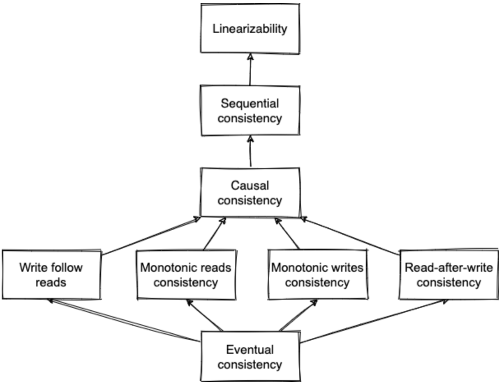
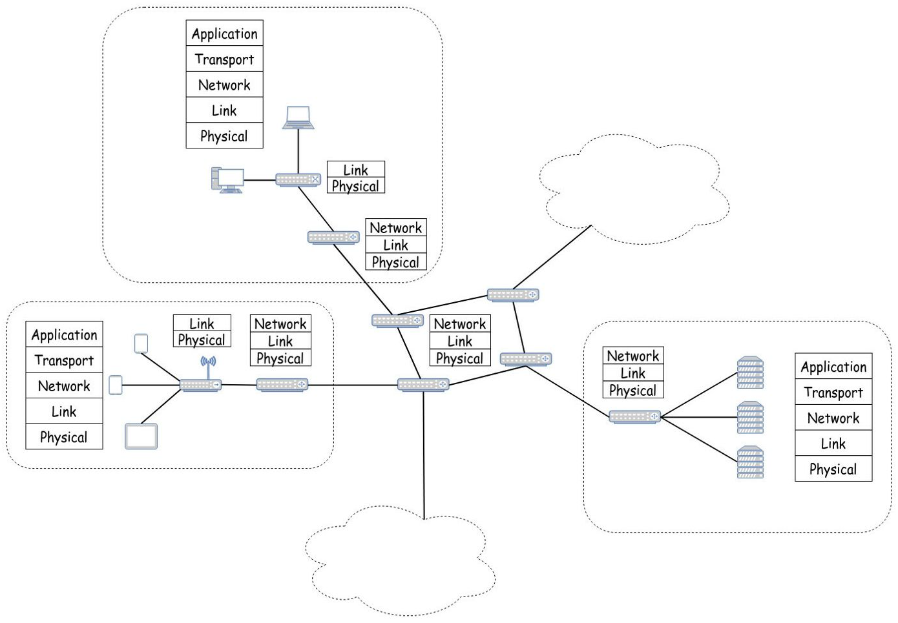
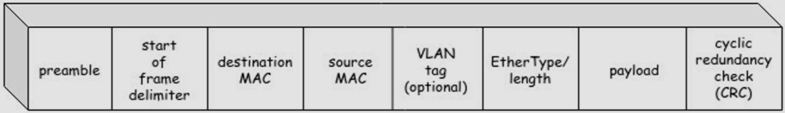

# Design Deck


???+ Success "Anki"

    Check the Anki version [here](anki.md).

## Cache

### Cache aside

Application is responsible for reading and writing to the DB (using write-through or write-back policy)

The cache doesn't interact with the storage directly


### Cache aside vs. read-through

Cache aside:
- Data model can be different from DB

Read-through:
- Same data model as DB
- Can use the refresh-ahead pattern

### Cache eviction policy

- LRU (Least Recently Used)
- LFU (Least Frequently Used)
- FIFO

### Cache locations

- Client caching
- CDN
- In memory
- Distributed cache
- Database caching (query or object)

### Cache: refresh-ahead

Cache to automatically refresh any recently accessed entry prior to its expiration

Used with read-through cache

* Pro: can result in reduced latency
* Con: not accurately predicting which items are likely to be needed in the future

### Cache: write through vs. write back

Main difference: consistency

Write through:
1. Write to the cache and the DB in a single DB transaction (may still lead to cache inconsistency if the DB commit failed)
2. Return

Write back:
1. Write to the cache
2. Return
3. Asynchronously store in DB

### Four main distributed cache benefits

- Improve read latency
- Can improve availability (e.g., DB unavailable, responses are served from the cache)
- Save computation time (e.g., SQL computation)
- Independently scalable from the rest of the system

### Main metric for cache

Cache hit ratio: hits / total accesses

### Read-through cache

Read-through cache sits in-line with the DB

Single entry point

### When to use a cache

- Speed up reads
- Response complex to compute

## Cloud

### CDN

Content Delivery Network

Network of geographically dispersed servers used to deliver static content (images, CSS, Javascript files, etc.)

Two kinds of CDNs:
- Push CDN: we are responsible for providing the content
- Pull CDN: CDN is responsible for pulling the right content (expiration to be used)

Pull is easier to handle whereas push gives us more flexibility

Use case for pull: Docker Hub S3 layer

## DB

### 3 main reasons to partition data

- Scalability
- Improve performance of write heavy systems (usually, for example, key range partitioning can improve reads)
- Dataset doesn’t fit into a single node

### ACID property

* Atomic: all transaction succeeds or none does (all or nothing)

* Consistency: from one valid state to another (invariants must always be true)

  Not necessarily a property of the DB (e.g., foreign key constraint), can be a property of the application (e.g., credits and debits must be balanced)

  Different from consistency in eventual consistency (which is more about convergence as the matter is replicating data)

* Isolation: a transaction is not affected by another ongoing transaction (a transaction cannot read from another transaction that has not yet been completed)

  Refers to serializability

* Durability: once a transaction is committed, it will remain in the system

### Anti-entropy

Optimization to favor latency over consistency when writing to a DB (e.g., leaderless replication)

Background process to constantly looks for differences in data

Could be used as an alternative or in conjunction with read repair

### Byzantine fault-tolerant

A system is Byzantine fault-tolerant if it continues to operate correctly if in the case of a Bizantine's problem (some of the nodes malfunctioning, not obeying the protocol or malicious attackers).

### CALM theorem

Consistency As Logical Monotonicity

A program has a consistent, coordination-free (e.g., consensus-free) distributed implementation if and only if it is monotonic

Consistency in this context doesn't mean linearizability. It focuses on the consistency of the program's output while traditional consistency focus on the consistency of reads and writes.

In CALM, a consistent program is one that produces the same output no matter in which order the inputs are processed and despite any conflicts.

Said differently, does the implementation produce the outcome we expect despite any race condition that may arise.

### CAP theorem

Consistency, availability, partition tolerance (e.g., one node cut off from the rest of the cluster because of a network partition) => pick 2 out of 3

C refers to linearizability

### Caveat of serializability

It's possible that serial order is different from the order in which transactions were actually run (latest may not win)

If not, we need a stricter isolation level: strict serializability (serializability + linearizability)

### Chain replication

Replication protocol that uses a different topology than leader based replication protocols like Raft

Left-most process referred as the chain's head, right-most as the chain's tail:
- Client send writes to the head, which updates its local state and forwards to the next process in the chain
- Next process updates its local state and forwards to the next process in the chain
- Etc.
- Once the update is received by the tail, the ack flows back to the head which replies to the client that the write succeeded


Fault tolerance is delegated to a dedicated component: control plane
- If head fails: the control plane removes it and makes the next as the head
- If intermediate node fails: the control plane removes it temporarily from the chain, and then adds it back eventually as the tail
- If tail fails: the control plane removes it and makes the predecessor as the new tail

Benefits:
- Strongly consistent protocol
- Reads are served from the tail without contacting other replicas first which allows a lower response time

Drawbacks:
- Writes are slower than quorum-based replication.
- A single slow node can slow down all writes.
- As reads are served from a single node, it can't be scaled horizontally. A mitigation is to allow intermediate nodes to serve reads but they can do it only if a read is considered as clean (the ack for this object has been returned to the predecessor). // The tail serves as the authority of the latest clean version

Notes:
- To avoid the overhead of having a single node handling the writes, we can find a way to shard data and handle multiple chains (see https://engineering.fb.com/2022/05/04/data-infrastructure/delta/)

### Chain replication vs. consensus

Similar consistency guarantees

Chain replication:
- Optimized for reads for CP systems
- Better read availability: a chain of n nodes can tolerate up to n-2 nodes failure

  Example with 5 nodes:
    - Chain replication: tolerate up to 3 nodes failure
    - Consensus with R=3 and W=3: tolerate up to 2 nodes failure

Consensus:
- Optimized for writes for CP systems

### Change data capture (CDC)

A datastore is selected as the authoritative source of data where all update operations are performed

An event log is then created from this datastore that is consumed by all the remaining operations the same way as in event sourcing

### Concurrency control

Ensures that correct results for concurrent operations are generated

Pessimistic: lock (mutual exclusion)

Optimistic: checks for conflicts at the end of a transaction

In the end, concurrency control serves the same purpose as atomicity

### Consensus

Set of processes agreeing on some data value in a fault-tolerant way

Satisfies safety and liveness

### Consistency models

Describe what expectations clients might have in terms of possible returned values despite the existence of multiple copies of data and concurrent access to it

Not the C in ACID but the C in CAP (converging to an end state)



* Eventual consistency: all the nodes converge to the same state (not necessarily the latest)

* Write follow reads: ensures that writes are ordered after writes that were observed by previous read operations

  Example:
    - P1 reads value => foo
    - P1 updates value to bar
      => Every node will converge to bar (a process can't read bar, then foo, regardless of the process)
      Also known as session causality

* Monotonic reads consistency: a client doing several reads in sequence will never go backward in time

* Monotonic writes consistency: values originating from the same client appear in the order the client has executed them

* Read-after-write-consistency: if a client performs a write, then this write if visible during subsequent reads

  Also known as read-your-writes consistency

* Causal consistency: operations that are causally related need to be seen in the same order by all the nodes

* Sequential consistency: operations appear to take place in some total order, and that order is consistent with the order of operations from each individual clients

  Twitter example: no guarantee between which tweet is seen first between two friends posting at the same time, but the ordering is guaranteed for the same friend

* Linearizability: make a system appear as if there is only a single copy of the data and all operations are atomic (one operation at a time)

  Even though there may be multiple replicas, the application does not need to worry about them

  C in CAP

  Real time guarantees

### CQRS

Command Query Responsibility Segregation

Dissociate writes (command) from reads (query)

Pros:
- Allows creating stores per use case (e.g., analytics, geospatial)
- Scale the read and write parts independently

Cons:
- Eventual consistency between the stores

### CRDT

Conflict-free Replicated Data Types

Data structure that is replicated across nodes:
- Replicas are updated independently, concurrently and without coordination
- An algo (part of the data type) can perform a deterministic conflict resolution
- Replicas are guaranteed to eventually converge to the same state
  => Strong eventual consistency

Used in the context of collaborative applications

Note: CRDTs can be combined to form new CRDTs

### CRDT and collaborative applications (e.g., Google Docs)

Compared to OT, each character has a stable identifier (even if characters are added or deleted)

Example: 0 is the beginning of the document, 1 is the end of the document, every character has a fractional number as an ID

May lead to interleaving problems (e.g;, two inserted words by two users are interleaved: "Alice", "Bob" => "BoAlibce"

Interleaving depends on the merging algorithm used (e.g., Treedoc doesn't lead to interleaving)

### DB indexes tradeoff

Speed up read query but slow down writes

### DB internal components

- Transport layer accepting requests
- Query processor determining the most efficient way to run queries
- Execution engine
- Storage engine


### DB: read vs. write-heavy, latency vs. consistency, availability vs. consistency, ACID vs. non-ACID


### Delta CRDTs

Optimized state-based CRDTs where only recently applied changes to a state are replicated instead of the full state

### Denormalization

Introduce some amount of duplication in a normalized dataset in order to speed up reads (e.g., denormalized document, cache or index)

Cons:
- Requires more space
- May slow down writes

### Design consideration when partitioning data

Should match the primary access pattern

### Downside of distributed transactions

Performance penalty

Example: distributed transactions in MySQL are reported to be over 10 times slower than single-node transactions

### Event sourcing

Ensures that all changes to application state are stored as a sequence of events

### Eventual consistency requirements

- Eventual delivery: every update applied at a replica is eventually applied to all replicas
- Convergence: guarantees that replicas have applied the same updates eventually reach the same state

### Examples of solutions offering leader election abstractions

- etcd (linearizable)
- ZooKeeper (not linearizable for read operations)

### Federation

Splits up DB by function

### Fencing token

Monotonically increasing token that increments whenever a client acquires a distributed lock

Use case: when writing to a DB, if the provided token has a lower value than the current one, rejects the write

Solve possible issues with lease as an update has to be made from the latest token

### Gossip protocol

Peer-to-peer protocol based on the way epidemics spread

No central registry and the only way to spread common data is to rely on each member to pass it along to their neighbors

Useful when broadcasting to a large number of processes like thousands or more, where a deterministic protocol wouldn't scale

### Graph DB main use case

Relational can handle simple cases of many-to-many relationships

Yet, if the connections become more complex, it's more natural to start modeling data as a graph

### Hinted handoff

Optimization to favor latency over consistency when writing to a DB

If a coordinator node cannot contact the necessary number of replicas, it stores locally the result of the operation and forward it to the failed node(s) after they recovered

Used in sloppy quorums

### Hot spot in partitioning

Partition is heavily loaded compared to others

Also called skew

### In a database, strategy to handle rebalancing

Not based on key hashing as a rebalancing would be huge

Simple solution: Create many more partitions than nodes and assign several partitions to each node (e.g., a db running on a cluster of 10 nodes may be split into 10k partitions). When a node is added to the cluster, it will steal a few partitions from every existing node

### Isolation levels

Degree to which transactions are isolated from other concurrent execution transactions

Isolations come at a performance cost (more coordination and synchronization)


* Dirty writes: a transaction overwrites a value that has previously been written by another transaction that is still in-flight and has not been committed yet

  => Can violate integrity constraints

* Dirty reads: a transaction observes a write from a transaction that hasn't been committed yet

  => decisions can be taken based on data updates that can be rolled back

* Fuzzy reads: a transaction reads a value twice but sees a different value in each read because a committed transaction updated the value between the two reads

* Lost updates: two transactions reads the same value and then try to update it to two different values, only one update survives

  Example: Two transactions read the current inventory size (say 100 items), add respectively 5 and 10 items and then store back the size. Depending on the execution order, then final order can be 110 instead of 115.

* Read skew: an integrity constraint seems to be violated because a transaction can only see partial results of another transaction

* Write skew: when two transactions read the same objects, and then updates some of those objects

  Example: Two on-call doctors for a shift. Both feeling unwell, and decide to request leave. They both click the button at the same time. In the case of a write skew, the two transactions can succeed as for both, when reading the number of available doctors, it was more than one.

* Phantom reads: when a transaction does a predicate-based read and another transaction writes or removes a data matched by this predicate while the first transaction is still in flight

  Example: Transaction A computes the max and average age of employees. Transaction B is interleaved and inserts a lot of old employees. Thus, the average age could be larger than the max.

### Known CRDTs

Counter:
- Grow-only counter: increment only
- Positive-negative counter: increment and decrement (combination of two grow only counter: one positive, one negative)

Register (a memory cell storing whatever):
- LWW-register: total order using timestamps
- Multi-value register: keep track of causality, in case of conflicts it returns all conflicting cases (analogy: Git with an interactive merge resolution)

Set:
- Grow-only set: once an element is added it can't be removed
- Two-phase set: elements can be added and removed (combination of two grow only set)
- LWW-element set (last-write-wins): similar to two-phase set but we associate a timestamp for each element to resolve conflicts
- Observed-remove set: use tags instead of timestamps; each element is associated to a list of add-tags and a list of remove-tags (example: vector clocks)
- Sequence: used to build collaborative applications (e.g., Treedoc)

### Last-write-wins (LWW)

Conflict resolution based on timestamp

Used by DynamoDB or Cassandra to resolve conflicts

Shouldn't happen in single-master replication

### Leader election

Algorithm to guarantee at most one leader at any given time (safety) and that an election eventually completes (liveness)

### LSM tree

Log-Structured Merge tree

Consists of smaller mutable memory-resident (memtable) and larger immutable disk-resident (SSTable) components

Memtables data are sorted and flushed on disk when their size reaches a configurable threshold or periodically

Because of a memtable is just a special case of buffer, durability is not guaranteed (durability must be brought by replication)

Examples: Lucene, Cassandra, Bitcask, etc.

### LSM tree vs. B-tree

LSM-tree faster for writes, slower for reads because it has to check multiple data structures (bigger read amplification): memtable and SSTable

Compaction can impact ongoing requests

B-tree faster for reads, slower for writes as it must write every piece of data at least twice in the WAL & tree itself (bigger write amplification)

Each key exists in exactly one place => easier to offer strong transactional semantics

### Main difference between consistency models and isolation levels

Consistency models: applies to single-object operations

Isolation levels: applies to multi-object operations

### Merkle tree

A tree in which every leaf is labelled with the hash of a data block:
- Level n contains the data blocks
- Level n-1 the hash of one data block
- Level n-2 the hash of 2 data blocks
- Level 1 the hash of all the data blocks


Efficient and secure verification of the contents of a large data structure

Allows reducing data transfered between a client and a server. For example, if we want to compare a merkle tree stored on a server with one store on the client, they can both exchange their top hash. If different, we can delve in and only get the data blocks which have changed.

### Monotonic reads consistency implementation

One way to achieve it is to make sure each user always makes their reads from the same replica

### MVCC

Multiversion Concurrency Control

A possible implementation of optimistic concurrency control and snapshot isolation level

MVCC allows reads and writes to proceed with minimal coordination on the storage level since reads can continue accessing older values until the new ones are committed

### N+1 select problem

Assuming a one-to-many relationship between 2 tables A and B => A 1-* B

If we want to iterate through all the A and for each one, print the list of B, the naive implementation would be:
- `select * from A`
- And then for each A, `select * from B where A_ID = ?`

Alternatively, we could reduce the number of rount-trips to the DB from N+1 to 2 with a simple `select * from B`

Most ORM tools prevent N+1 selects

### NoSQL: main types and main architecture principles

Key-value store, document store, column-oriented store or graph DB

- Mainly partition-based
- Leverage eventual consistency

### Operation-based CRDTs

Commutative replicated data types

Replication is made in propagating the update operation

Operations characteristics:
- Must be commutative.
- Not necessarily idempotent. If idempotent, OK. If not, it's up to the delivery layer to ensure the operations are delivered without duplication.
- Delivered in causal order.

### Operational transformation (OT): concept and main drawback

A way to handle collaborative applications

Receive update operations and depending on the operations that occur concurrently, transform them

Example:
- Initial state: "helo"
- Concurrently: user 1 inserts "l" at position 3 and user 2 inserts "!" at position 4
- If transaction for user 1 completes before the one of user 2, we end up with "hell!o" instead of "hello!"
- OT will transorm the transaction from user 2 into: insert "!" at position 5

Drawback: all the communications go through a central server (e.g., impossible with systems at scale such as Google Docs)

Replaced with CRDT

### Optimistic concurrency control: pros and cons

Perform badly if high contention as it leads to a high proportion of retry, thus making performance worse

If not much contention, it tends to perform better than pessimistic

### PACELC theorem

If case of a network partition (P): we should choose between availability (A) or consistency (C)

Else, in the absence of partition (E): we should choose between latency (L) or consistency (C)

Most systems are either:
- AP/EL
- CP/EC

### Partitioning (sharding)

Split up a large dataset that is too big for a single machine into smaller parts and spread them across several machines

Define the partition type based on the primary access pattern

### Partitioning criteria

Range partitioning: keys are sorted and a partition owns all the keys from some minimum up to some maximum (example: MySQL RANGE COLUMNS partitioning)
- Pros: efficient range queries
- Cons: Risk of hot spots, requires repartitioning to potentially split a range into two subranges if a partition gets too big

Hash partitioning: hash function is applied to each key and a partition owns a range of hashes

### Partitioning methods

Horizontal partitioning: partition by rows

Vertical partitioning: partition by columns (create tables with fewer columns)

Rationale: if the subtables have different access patterns (e.g., a column is a blob that we rarely consume, we can create a vertical partitioning to store this blob not on the primary disk)

Also called normalization

### Quorum

Minimum number of nodes that need to vote on an operation before it can be considered successful

Usually: majority

### Raft

Leader election and replication algorithms

#### Leader election

Using a state machine to elect a leader

Each process is in one of these three states: leader, candidate (part of the election process), follower

#### Replication

The leader stores the sequence of operations altering the state into a local ordered log

Then, this log is replicated across followers
Each entry is considered as committed when it has been replicated on a majority of nodes

Replication enables consensus

### Read repair

Optimization to favor latency over consistency when writing to a DB (e.g., leaderless replication)

If a coordinator node receives conflicting values from the contacted replicas (which shouldn't happen in case of single-master replication for example), it resolves the conflict by:
- Resolving the conflict (e.g., LWW)
- Forwarding it to the stale replica
- Responding to the read request

### Relation between replication factor, write consistency and read consistency

Given:
- N: number of replicas
- W: number of nodes that have to ack a write for it to succeed
- R: number of nodes that have to respond to a read operation for it to succeed

If R+W > N, the system can guarantee to return the most recent written value because there's always an overlap between read and write sets (consistency)

Notes:
- In case of read-heavy systems, we want to minimize R
- If W = 1 and R = N, durability isn't guaranteed in the presence of failure
- If W < (N+1)/2, it may leads to write conflicts (e.g., W < 2 if 3 nodes)
- If R+W <= N, weak/eventual consistency

### Replication vs. partition: impacts

Replication:
- Read-heavy
- Availability > consistency

Partition:
- Write-heavy (splitting up data across different shards)

### Schema-on-read vs. schema-on-write

Schema-on-read: implicit schema but not enforced by the DB (also called schemaless but misleading)

Schema-on-write: explicit schema, the DB ensures all writes are conforming to it (e.g., relational DB)

### Serializability

I in ACID (strong isolation level)

Equivalent to serial execution (no interleaving due to concurrent transactions)

### Serializable Snapshot Isolation (SSI)

Snapshot Isolation (SI) allows write skew

SSI is a stricter isolation level than SI preventing write skew: check at runtime for conflicts between transactions

Downside: increase the number of aborted transactions

### Single-leader, multi-leader, leaderless replication

#### Single-leader

All writes go through one leader

Pro: ensure consistency

Con: all writes go through a single node (bottleneck)

#### Multi-leader

Rarely makes sense within a single datacenter (benefits rarely outweigh the added complexity) but used in multi-datacenter contexts

DB must resolve the conflicts in a convergent way

Use cases:
- One leader per datacenter


- Clients with offline operation
- Collaborative editing

Different topologies:


Most used: all-to-all

Pro: not limited to the write throughput of a single node

Con: possible write conflicts

#### Leaderless replication

Client sends its writes to several replicas in parallel

Read requests are also sent in parallel to multiple replicas (this way, if a write hasn't been replicated yet to one replica, it won't lead to stale data)

Rely on read repair and anti-entropy mechanisms

Rely on quorum to know how long to wait for a request (not perfect: if a write fails because we didn't reach a quorum, what shall we do about the replicas where the write has already been committed)

Examples: Cassandra, DynamoDB, Riak

Pro: throughput

Con: quorums are not perfect, provide illusion of strong consistency when  in reality, it's often not true

### Sloppy quorum

In case of a quorum of w nodes to accept a write: if we can't reach w, the DB accepts the write replicate it to nodes that aren't among the ones on which the value usually lives

Relies on hinted handoff

### Snapshot Isolation (SI)

Guarantee that all reads made in a transaction will see a consistent snapshot of the database

In practice, it reads the last committed values that existed at the time it started

Allows write skew

### Snapshot Isolation common implementation

MVCC

### SSTable

Sorted String Table, immutable components of a LSM tree

Sorted immutable data structure

It consists of 2 components: index files and data files

The index (based on a hashtable or a B-tree) holds the keys and the data entries (offsets in the data file where the actual records are located)

Data files hold records in key order

### State-based CRDTs: definition and requirements

Convergent replicated data types

Replication is made in propagating the full local state to replicas

States are merged with a function which must be:
- Commutative
- Idempotent
- Associative
  => Update monotonically increase the internal state according to some partial order rules defined (e.g., max of two values, union of two sets)

=> Delivery layer doesn't have to guarantee causal ordering nor idempotency, only eventual delivery

### Strong eventual consistency: definition and requirements

Stronger guarantee than eventual consistency

Based on the fact that we can define a deterministic outcome for any conflict

Requires:
- Eventual delivery: every update applied to a replica is eventually applied to all replicas
- Strong convergence: guarantees that replicas that have executed the same updates have the same state (with eventual consistency, the guarantee is that the replicas eventually reach the same state, once consensus is reached)

Strong convergence requires convergent replicated data types (part of CRDT family)

Main difference with eventual consistency:
- Leaderless replication
- No consensus needed, instead, it relies on a deterministic outcome for any conflict

A solution to the CAP theorem

### Three-phase commit (3PC)

Failure-resilient refinement of 2PC

Unlike 2PC, satisfies liveness but not safety

### Transaction

A unit of work performed in a database system, representing a change, which can be potentially composed of multiple operations

### Two main approaches to partition a table that has secondary indexes

Partitioning secondary indexes by document:
- Each partition maintains its own secondary index
- Write: one partition
- Query on the index: requires querying multiple partitions (scatter/gather)

Optimized from writes

Example: Elasticsearch, MongoDB, Cassandra, Riak, etc.

Partitioning secondary indexes by term:
- Global index covering all the partitions (to be replicated)
- Write: multiple partitions are updated (for resiliency)
- Query on the index: served from one partition containing the index

Optimized from reads

### Two types of CRDTs

Operation-based and state-based

Operation-based require less bandwidth

State based require less assumptions about the delivery layer

### Two-phase commit (2PC)

Protocol used to implement atomic transaction commits across multiple processes

Satisfies safety but not liveness

### WAL

Write-ahead log (or redo log)

Append-only file to which every modification must be written

Used for restoration in the event of a DB crash:
- Durability
- Atomicity (allows to identify the operations on progress and complete or undo them)

### When relational vs. when document

Relational (schema-on-write):
- Better support for joins
- Many-to-one and many-to-many relationships
- ACID

Document (schema-on-read):
- Schema flexibility
- Better performance due to locality
- Closer to the data structures used by the application
- In general not ACID
- In general write-heavy

### When to use a column-oriented store

Because columns are stored contiguously: analytical workloads (computing average values, finding trends, etc.)

Flexible schema

Limited space (storing same data type together offers a better compression ratio)

### Why DB schemaless is misleading

There is an implicit schema but not enforced by the DB

More accurate term: schema-on-read

Different from relational DB with shema-on-write where the schema is explicit and the DB ensures all written data conforms to it

Similar to dynamic vs. static type checking in a programming language

### Why is in-memory faster

Not necessarily because they don't need to read from disk (even a disk-based storage engine may never need to read from disk if enough memory)

Can be faster because they avoid the overhead of encoding in a form that can be written to disk

### Write and read amplification

Ratio of the amount of data written/read to the disk versus the amount of data intended to be written

### Write heavy and replication type

Do not rely on single-master replication as it heavily impacts the scaling of write-heavy systems

Instead, rely on leaderless replication

Trade off: consistency is harder to guarantee 

## Design

### Auditing

Checking the integrity of data

### Backward vs. forward compatibility


### Bloom filter

Probabilistic, memory-efficient data structure for approximating the content of a set

Can tell if a key does not appear in the DB

### Causality

Causal dependency: one event causing another

Happened-before relationship

### Concurrent operations

Not only operations that happen at the same time but also operations made without knowing about each other

Example:
- Concurrent to-do list operations with a current "Buy milk" item
- User 1 deletes it
- User 2 doesn't have an internet connection, modifies it into "Buy soy milk", and then is connected again => this modification may have been done one hour after user 1 deletion

### Consistent hashing

Special kind of hashing such that when a resize occurs, only 1/n percent of the keys need to be rebalanced (n: number of nodes)

Solutions:
- Ring consistent hash with virtual nodes to improve the distribution
- Jump consistent hash: faster but nodes must be numbered sequentially (e.g., if we have 3 servers foo, bar, and baz => we can't decide to remove bar)

### Design impacts of sharing

May decrease:
- Availability
- Performance
- Scalability

### Design: read-heavy vs. write-heavy impacts

Read heavy:
- Leverage replication
- Leverage denormalization

Write heavy:
- Leverage partition (usually)
- Leverage normalization

### Different types of message failure

- Delayed
- Dropped
- Duplicated
- Out-of-order

### Event log vs. message queue

Event log:
- Consumers are free to select the point of the log they want to consume messages from, which is not necessarily the head
- Log is immutable, messages cannot be removed by consumers (removed by a GC running periodically)

### Exactly-once delivery

Impossible to achieve

However, we can achieve exactly-once processing using a dedup or by requiring the consumers to be idempotent

### FLP impossibility

In an asynchronous distributed system, there's no consensus algorithm that can satisfy:
- Agreement
- Validity
- Termination
- And fault tolerance

### Geohashing

Encode geographic coordinates into a short string called a cell with varying resolutions

The more letters in the string, the more precise the location


Main use case:
- Proximity searches in O(1)

### Hashing definition and size of MD5 and SHA256

Map data of arbitrary size to fixed-size values

Examples:
- MD5: 16 bytes
- SHA256: 32 bytes

### HDFS

Distributed filesystem:
- Fault tolerant
- Scalable
- Optimised for batch operations

Architecture:
- Single master (maintain filesystem metadata, inform clients about which server store a specific part of a file)
- Multiple data nodes

Leverage:
- Partitioning: each file is partitioned into multiple chunks => performance
- Replication => availability

Read: communicates with the master node to identify the servers containing the relevant chunks

Write: chain replication

### How to reduce sharing

- Decompose stateful and stateless parts of a system => makes scaling easier
- Partitioning => fault isolation

### HyperLogLog

Used to approximate cardinality of a set

Optimization for space over perfect accuracy

#### Backing idea

Coin flip game: you flip a coin, if head, flip again, if tail stop

If a player reaches n flips, it means that on average, he tried 2n+1 times

#### Algo

For an ID, we will count how many consecutive 0 (head) bits on the left

Example: 001110 => 2

Hence, on average we should have seen 22+1 visitors

Requirement: we need visitors ID to be uniform => either if the ID is randomly generated or by hashing them (if ID is auto incremented for example)

Required memory: log(log(m)) with m the number of  unique visitors

Problem with this algo: it depends on luck. For example, if user 00000001 connects every day => the system will always approximate 28 visitors

#### Bucketing

Distribute to multiple counters and aggregate the results (possible because each counter is very small)

If we want 4 counters, we distribute the ID based on the first 2 bits

Result: 2(n1 + n2 + n3 + n4) / 4

Problem: mean is highly impacted with large outliers

Solution: use harmonic mean

### Idempotent

If executed more than once it has the same effect as if it was executed once

### Latency numbers every programmer should know

- Read 1MB sequentially from memory: 250 µs
- Round trip within the same datacenter: 0.5 ms
- Read 1MB sequentially from SSD: 1 ms
- Disk seek: 10 ms
- Read 1MB sequentially from disk: 20 ms
- Send round trip packet over continents: ~100 ms

### Lease

Lock with an expiry timeout after which the lock is automatically released

May lead to situations where two nodes believe they hold the lock (for example, when the expiry signal hasn't been caught yet by the first node because of a GC or CPU throttling)

Can be solved using a fencing token

### Least loaded endpoint load balancing strategy

Not efficient

A more efficient option is to randomly pick two servers and route the request to the least-loaded one of the two

### Liveness property

Something good will eventually occur

Example: leader is elected, eventual consistency

### Load balancing

Route requests across a pool of servers

### Load shedding

Action to reduce the load on something

Example: when the CPU utilization reaches a threshold, the server can start returning errors

A more special form of load shedding is selective client throttling, where an application assigns different quotas to each of its clients

### Locality

Performance optimization to put several pieces of data in the same place

### Log

Append-only, totally ordered sequence of messages

Each message is:
- Appended at the end of the log
- Is assigned a unique sequential index

Example: Kafka

### Log compaction

Throw away duplicate keys in the log and keep only the most recent update for each key

### Main drawback of shared-nothing architectures

Reduce flexibility

If the application needs to access to new data access patterns in an efficient way, it might be hard to provide it given the system's data have been partitioned in a specific way

Example: attempting to query by a secondary attribute that is not the partitioning key might require to access all the nodes of the system

### MapReduce

Programming model for processing large amounts of data in bulk across many machines:
- Map: processes a set of key/value pairs and produces as output another set of intermediate key/value pairs.
- Reduce: receives all the values for each key and returns a single value, essentially merging all the values according to some logic

### Microservices: pros and cons

Pros:
- Organizational (each team dictates its own release schedule, etc.)
- Codebase is easier to digest
- Strong boundaries
- Independent scaling
- Independent data model

Cons:
- Eventual consistency
- Remote calls
- Harder to operate (more complex)

### Number of values to generate to reach 50% chances of collision: 32-bit, 64-bit, and 128-bit hash

- 32: 80 k
- 64: 5 billion
- 128: 3e+18 (1 billion hashes generated every second for 100 years)

### Orchestration vs. choreography

Orchestration: single central system responsible for coordinating the execution

Choreography: no need for a central coordinator, each system is aware of the previous and the next

### Outbox pattern

Used to update a DB and publish an event in a transactional fashion

Within a transaction, persist in the DB (insert, update or delete) and insert at the same time a new row in an event table

Implements a worker that checks the event table, publishes an event and deletes the row (at least once guarantee)

### Perfect hashing

No collision, only possible if we know the keys up front

Given k elements, the hashing function returns an int between 0 and k

### Quadtree

Tree data structure where each internal node has exactly four children: NE, NW, SE, SW

Main use case:
- Improve geospatial caching (e.g., 1km in an urban area isn't the same as 1km outside cities)

Source: https://engblog.yext.com/post/geolocation-caching

### Rate-limiting (throttling): definition and algos

Mechanism that rejects a request when a specific quota is exceeded

#### Token bucket algo

Token of a pre-defined capacity, put back in the bucket periodically:


#### Leaking bucket algo

Uses a FIFO queue
When a request arrives, checks if the queue is full:
- If yes: request is dropped
- If not: added to the queue
  => Requests pulled from the queue at regular intervals


### Rebalancing

Move data or services from one node to another in order to spread the load fairly

### REST

Architectural style where the server exposes a set of resources

All communications must be stateless and cacheable

Relies mainly on HTTP but not mandatory

### REST vs. gRPC

REST (architectural style):
- Universality
- Standardization (status code, ETag, If-Match, etc.)

gRPC (RPC framework):
- Contract
- Binary protocol (faster, less bandwidth) // We could use HTTP/2 without gRPC and leverage binary protocols but it would require more efforts
- Bidirectional

### Safety property

Something bad will never happen

Example: leader election eventually completes

### Saga

Distributed transaction composed of a set of local transactions

Each transactions has a corresponding compensation action to undo its changes

Usually, a Saga is implemented with an orchestrator that manages the execution of the transactions and handles the compensations if needed

### Scalability

System's ability to cope with increased load

### Scalability ceiling

Hard limit (e.g., device maximum throughput)

### Shared-nothing architectures

Reduce coordination and contention so that every request can be processed independently by a single node or group of nodes


Increase availability, performance, and scalability

### Source of truth

Holds the authoritative version of the data

### Split-brain

Network partition => nodes unable to communicate with each other => multiple nodes believing they are the leader

As a node is unaware that another node is still functioning, it can lead to data corruption or data loss

### Throughput

The rate of work performed

### Total vs. partial order

Total order: a binary relation that can be used to compare any 2 elements of a set with each other

Partial order: a binary relation that can be used to compare only some of the elements of a set with each other

Total ordering in distributed systems is rarely mandatory

### UUID

128-bit number

Collision probability: after generating 1 billion UUID every second for ~100 years, the probability of creating a single duplicate reaches 50%

### Validation vs. verification

Validation: process of analyzing the parts of the system and building mental models that reflects the interaction of those parts

Example: validate the quality of water by inspecting all the pipes and infrastructure to capture, clean and deliver water

Verification: process of analyzing output at a system boundary

Example: validate the quality of water by testing the water (output) coming from a sink

### Vector clock

Algorithm that generates partial ordering of events and detects causality violation

### Why asynchronous communication

Reduce temporal coupling (not connected at the same time) => processes execute at independent rates, without blocking the sender

If the interaction pattern isn't request/response with client blocking until it receives the response

## HTTP

### 301 vs. 302

301: redirect permanently

302: redirect temporarily

### 403 or 404?

Retuning 403 can leak existence of a resource

Example: Apple is secretly working on super cars and creates an internal GET `https://apple.com/supercar` endpoint

Returning 403 means the user doesn't have the rights to access the resource, but leaks the existence of `/supercar`

### Cookie

Small files stored on a user's computer to hold specific data (e.g., language preference)

Requests made by the browser will contain cookies data

Types of cookies:
- Session cookies: only lasts for the duration of a session
- Persistent cookies: outlast user session
- Third-party cookies: used for advertising

### Four main HTTP/2 features

- Request multiplexing: multiple requests over a single TCP connection
  => Prioritization can now be part of the request
- Server push
- Binary protocol (lower overhead in decoding data, smaller network footprint)
- Header compression

### HLS

HTTP live streaming: video streaming protocol

### HTTP

Request/response protocol used to encode and transport information between a client and a server
Stateless (each request is executed independently)

The request and the response are 2 standard message types exchanged in a single HTTP transaction
- Request: method, URL, HTTP version, headers, body
- Response: HTTP version, status, reason, headers, body

Example of a POST request:

```http request
POST https://example.com HTTP/1.0
Host: example.com
User-Agent: Mozilla/4.0
Content-Length: 5

Hello
```

Application layer protocol (OSI level 7)

Relies on a transport protocol (OSI level 4, TCP most of the time but not mandatory) for error detection, flow control, reliability, etc.

### HTTP cache-control header

Allows setting how long to cache a response

Part of the response header (hence, cached by the browser) but can be part of the request header too (hence, cached on server side)

If request header marked as private, the results are intended for a single user (then won't be cached by a load balancer for example)

### HTTP Etag

Entity tag header that allows clients to make conditional requests

Server returns an ETag being the date and time of the last update of a resource

Client sends a `If-Match` header to update a resource only if clients have the most recent version

### HTTP keep-alive

Maintain a persistent TCP connection (reduces the number of TCP and HTTPS handshakes)

### HTTP methods: safeness and idempotence

- GET: safe, idempotent
- PUT: not safe, idempotent
- POST: not safe, not idempotent
- DELETE: not safe, idempotent

### HTTP safe method

Doesn't have any visible side effects and can be cached

### HTTP status code 429

When clients are throttled, the most common way is to return a 429 (Too Many Requests)

The response can also include a Retry-After header indicating how long to wait before making a new request (in seconds)

### HTTP status codes

- 2xx: success
- 3xx: redirection
- 4xx: client error
- 5xx: server error

### What happens if you type google.com in your browser

- URL parsing
- HSTS lookup (HTTP Strict Transport Security: list of websites that have requested to be contacted via HTTPS only)
- DNS lookup:
    - Is DNS record cached in browser?
    - If not present, check if the hostname can be resolved by reference in the local hosts file
    - If not present, DNS lookup (typically to the ISP DNS) // Uses ARP to get the MAC address of the DNS IP address
- Opens a TCP socket
- TCP handshake
- HTTPS handshake
- HTTP request (GET, port 80)
- Receive HTML, javascript (to be executed on client side), and images. Data can be cached by the browser using HTTP Etag.

Source: https://github.com/alex/what-happens-when

## Kafka

### Consumer types

Without consumer group: each consumer will receive all the messages in a topic

With consumer group: each consumer will receive a subset of the messages

Each consumer is assigned to multiple partitions (zero to many)

A partition is always assigned to only one consumer

If there are more consumers than partitions, some consumers will not be assigned to any partition (scalability ceiling)

### Durability/availability and latency/throughput tradeoffs


Source: https://developers.redhat.com/articles/2022/05/03/fine-tune-kafka-performance-kafka-optimization-theorem#kafka_priorities_and_the_cap_theorem

### Log compaction

Log compaction is a mechanism to give per-record retention to a topic

It ensures that Kafka will always retain at least the last message for each key of a given partition

A partition that is not yet compacted may have more than one message with the same key

Property:
- `retention.ms`: maximum time the topic will retain old log segments before deleting or compacting them (default: 7 days)

For low-throughput topic (topics with segments that should be rolled out because of `segment.ms` rather than `segment.bytes`), we should ensure that segment.ms is lower than `retention.ms`

### Offset

A strictly increasing identifier per partition

### Partition

Topics are divided into partitions

A partition is an ordered, immutable log of messages

No guaranteed ordering per topic with multiple partitions

Yet, the ordering is guaranteed per partition

### Partition distribution

The client implements a partitioner based on the key (e.g., hash(key) % number of partitions)

This is not done on Kafka's side

* Default hash in Java: murmur2
* Default hash in Go: FNV-1a

If key is empty: round-robin

### Rebalancing

Not possible to decrease the number of partitions: topic has to be recreated

Possible to increase the number of partitions

Possible issue: no more guaranteed ordering as one key may be assigned to a different partition

### Segment

Each partition is divided into segments

Instead of storing all the messages of a partition in a single file, Kafka splits them into chunks called segments
A log segment is a file identified by the first message offset it contains

Properties:
- `segment.bytes`: maximum segment file size before creating a new segment (default: 1GB)
- `segment.ms`: period after which a new segment is created, even if the segment is not full (default: 7 days)

### Shared subscription

Distribute messages

All the consumers from one consumer group receive a portion of the messages

One partition is assigned to one consumer, one consumer can listen to multiple partitions

## Math

### Associative property

A binary operation is associative if rearranging the parentheses in an expression will not change the result

Example: `+` is associative; e.g., (2 + 3) + 4 = 2 + (3 + 4)

### Commutative property

A binary operation is commutative if changing the order of the operands doesn't change the result

Example: `+` is commutative, `/` isn't commutative

### Harmonic mean


x1: probability of p1 (e.g. 0.5)

Less sensitive to large outliers

## Network

### ARP protocol

Map an IP address to a MAC address

### Average connection speed in USA

42 Mbps

### Backpressure

A node limits its own rate of sending in order to avoid overloading. Queueing is done on the sender side.

Also known as flow control

Example: TCP flow control

### Bandwidth

Maximum amount of data that can be transferred in a unit of time

### BGP

Border Gateway Protocol: Routing system of the internet

When a client submits data via the Internet, BGP is responsible for looking at all of the available paths that data could travel and picking the best route

Note: The chosen route isn't necessarily the fastest one, it can be the cheapest one. See https://technology.riotgames.com/news/fixing-internet-real-time-applications-part-i.

### CORS

Cross-origin resource sharing

Mechanism to allow restricted resources on a page to be requested from another domain outside the domain from which the resource was served

It extends and adds flexibility to SOP (Same-Origin Policy, same domain)

Example: User visits A and the page attempts to fetch data from B:
1. Browser sends a GET request to B with Origin header A
2. Server may respond with:
- Access-Control-Allow-Origin (ACAO) header set to the domain A
- ACAO set to a wildcard (*) indicating that the requests from all domains are allowed
- An error if the server does not allow a cross-origin request

### Difference ping & heartbeat

Ping: sends messages to a process and expects a response within a specified time period (request-reply)

Heartbeat: a process is actively notifying its peers that it's still running by sending a message (notification)

### Difference TCP & UDP

* Connection-oriented / Connectionless
* Reliable / Unreliable
* Ordered / Unordered
* Heavyweight / Leightweight

### Difference view & materialized view

A view is just an abstraction (SQL request is rewritten to match the actual schema)

A materialized view is a copy (written to disk)

### DNS

Domain Name System: automatic translation between a name and an IP address


Notes:
- Usually the local DNS configuration is the ISP one (config initialized from the router or static config)
- The browser, the OS and the DNS resolver all use caches internally
- A TTL is used to inform the cache how long the entry is valid

### DNS lookup: push or pull

DNS is based on the pull mode:
- If record is present: DNS will return it
- If record isn't present: DNS will pull the value, store it, and then return it

Notes:
- New DNS records are immediate
- DNS updates are slow because of TTL (there is no propagation, we wait for cached records to expire)

### Health checks: passive vs. active

Passive: performed by the load balancer as it routes incoming requests (e.g., 503)

Active: the load balancer actively checking the health of the servers via a query to their health endpoint

### Internet model

A network of networks



### Layer 4 vs. layer 7 load balancer

Layer 4 is faster and requires less computing resources than layer 7 is but less flexible

Layer 4: look at the info at the transport layer to distribute the requests (source, destination, port)

Forward packet using NAT

Layer 7: look at the info at the application layer to distribute the requests (header, message, etc.)

Terminate the network traffic, read then open a connection to the target server

A layer 7 can de-multiplex individual HTTP requests where multiple concurrent streams are multiplexed on the same TCP connection

### MAC address

A unique identifier assigned to a network interface

### Max size of a TCP packet

64K

### MQTT LWT

Last Will and Testament

Whenever a client is marked as disconnected (proper disconnection or heartbeat failure), it triggers to send a message in a particular topic

### NTP

Network Time Protocol: used to synchronize clocks

### OSI model

7 layers:
1. Physical: transmission of raw bits over a physical link (e.g., USB, Bluetooth)
2. Data link: responsible from moving a packet of data from one node to a neighbouring node
3. Network: provides a way of sending packets between nodes that are not directly linked and might belong to other networks (e.g., IP, iptables routing)
4. Transport: application to application communication, based on ports when multiple applications on the same node wants to communicate (e.g., TCP, UDP)
5. Session
6. Presentation
7. Application: protocol of exchanges between the two sides (e.g., DNS, HTTP)

### Routers

A way to connect networks that are connected with each other (used for the Internet)

Capable of routing packets properly across networks so that they reach their destination successfully

Based on the fact that an IP has a network prefix

### Routers buffering

Routers use queuing (buffering) to address network congestion

A buffer has a fixed size and a fixed number of packets

If no available buffer: packet is dropped

Note: not a way to increase the throughput

### Routers processing

Per-packet processing, no buffering

Impacts:
- It’s faster to route 10 packets of 1000 bytes than 20 packets of 500 bytes
- Sending small packets more frequently can fill the router buffer more quickly

Source: https://technology.riotgames.com/news/fixing-internet-real-time-applications-part-i

### Routing table

- Network destination and mask (together form the network identifier)
- Gateway: next node to which a packet has to be sent
- Interface: corresponding interface through which the gateway can be reached

Example:

| Destination | Network mask  | Gateway   | Interface |
|-------------|---------------|-----------|-----------|
| 0.0.0.0     | 0.0.0.0       | 240.1.1.3 | if1       |
| 240.1.1.0   | 255.255.255.0 | 0.0.0.0   | if1       |

### Service mesh

All network traffic from a client goes through a process co-located on the same machine (sidecar)

Used to facilitate service-to-service communications

### Switch

Receive frame and forward to specific links they are addressed to. Used for local networks.

Example: Ethernet frame



To do this, the switch maintains a switch table that maps MAC addresses to the corresponding interfaces that lead to them

At first, the switch table is empty. If the entry is empty, a frame is forwarded to all the interfaces (switches are self-learning)

### TCP congestion control

Determine dynamically the throughput (the number of segments that can be sent without an ack):
- Increase exponentially for every segment ack
- Decrease with a missed ack

Upon a new connection, the size of the window is set to a system default

It's one of the reasons why reusing a TCP connection leads to a performance increase

### TCP connection backlog

SYN requests are queued before being accepted by a user-mode process

When there are too many requests for the process, the backlog reaches a limit and SYN packets are dropped (to be later retransmitted by the client)

### TCP flow control

A receiver communicates back to the sender the size of the buffer when acknowledging a segment

Backpressure mechanism

### TCP handshake

3-way handshake
- syn (sender to receiver)
- syn-ack (receiver to sender) // ack the segment number received
- ack (sender to receiver) // ack the segment number received

### Websocket

Communication protocol (layer 7) provides a full-duplex communication channel over a single TCP connection and bidirectional streaming capabilities

Different from HTTP but compatible with HTTP (starts as an HTTP connection and then is upgraded via a well-defined handshake to a TCP connection)

Obsolete with HTTP/2

### Why can't we rely on the system clock in distributed systems?

- There's no guarantee that times are synchronized
- In the case of an NTP synchronization, the system clock of one node can jump backward in time

## Reliability

### Bulkhead pattern

Provides guaranteed fault isolation by design

Based on the idea of partitioning a shared resource to isolate failures

### Cascading failure

A process in a system of interconnected parts in which the failure of one or few parts can trigger the failure of other parts and so on

### Causal consistency implementation

When a replica receives a new write, it doesn't apply it locally immediately. First, it checks whether the write's dependencies have been committed locally. If not, it waits until the required version appears.

### Circuit breaker

Used to prevent a network or service failure from cascading to other failures

Implemented on the client-side

Three states:
- Closed: accept requests
- Open: do not accept requests and fail immediately
- Half-open: give the service another chance (can also be implemented using a probe)

The circuit can be opened when the health endpoint of the service is down or when the number of consecutive errors reaches a threshold

### Exponential backoff

Wait time increased exponentially after every retry attempt

### Fault tolerance

Property of a system that can continue operating correctly in the presence of failure of its components

### Jitter

Introduces a part of randomness to avoid synchronized retry spikes experienced during cascading failures

### Knee point

Moment when linear scalability is not possible anymore

### Phi-accrual failure detector

Instead of treating failure node failure as a binary problem (up or down), a phi-accrual failure detector has a continuous scale, capturing the probability of the monitored process's crash

Works by maintaining a sliding window, collecting arrival times of the most recent heartbeats

Used to approximate the arrival time of the next heartbeat and compute a suspicion level (how certain the failure detector is about a failure)

### Retry amplification

Having retries at multiple levels of the dependency chain can amplify the number of retry

The deeper a service in the chain, the higher the load it will be exposed to due to amplification:


In case of a long dependency chain, perhaps we should only retry at a single level of the chain

## Security

### Authentication

Process of determining whether someone or something is who or what it declares itself to be

### Certificate authorities

Organizations issuing certificates by signing them

### Cipher

Encryption algorithm

### Confidentiality

Process of protecting information from being accessed by unauthorized parties

Mainly achieved via encryption

### Integrity

The process of preserving the accuracy and completeness of data over its entire lifecycle, so that they cannot be modified in an unauthorized or undetected manner

### Mutual TLS

Add client authentication using a certificate

### OAuth 2

Standard for access delegation

Process
- Client gets a token from an authorization server
- Makes a request to a server using the token
- Server validates the token to the authorization server

Notes: some token types like JWT are self-contained, meaning the validation can be done by the server without a call to the authorization server

### Public key infrastructure (PKI)

System for managing, storing, and distributing certificates

Relies on certificate revocation lists (CRLs)

### TLS handshake

With mutual TLS:

1. Client hello: protocol, cipher, etc.
2. Server hello: supported cipher, etc.
3. Server sends its certificate
4. Client checks the server certificate (e.g., make sure the CA are trusted in its truststore, etc.)
5. Client sends its certificate
6. Server checks the client certificate
7. The client generates a session key encrypted with the public key of the client certificate (asymmetric encryption) and sends it to the server
8. Client sends data and encrypts each packet using the session key (symmetric encryption)

One way: the session key is generated by the client

### Two main uses of encryption

Encryption in transit

Encryption at rest

### Two types of encryption

Symmetric: key is shared between a client and a server (faster)

Asymmetric: two keys are used, a private and a public one
- Client encrypts a message with the public key
- Server decrypts the message with its private key

### What does digital signature provide

Integrity and authentication

### What does TLS provide?

- Confidentiality
- Authentication
- Integrity
